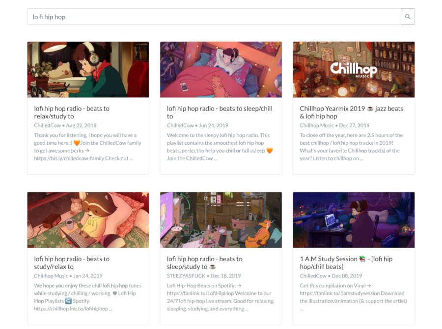
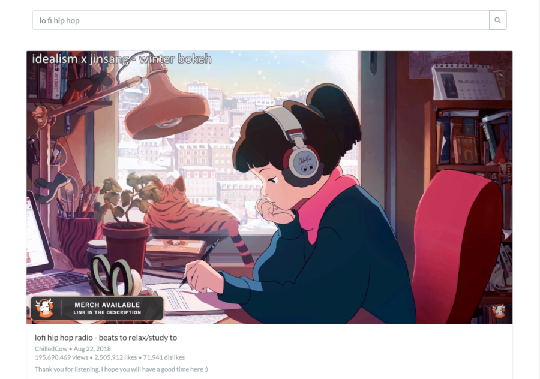

# Minimal Youtube

*This is an old version of Minimal Youtube I developed with vanilla Javascript in order to practice coding in JS without the use of any frameworks or major libraries. The code is not very good, so I've decided to rebuild the entire application in React.*

A minimalist YouTube client free from comments, recommendations, and other distractions.
Simply enter a search term and watch relevant videos. Perfect for looking up music, tutorials,
and other videos while doing focused work. Try it [here.](https://emmadusmani.github.io/minimal-youtube/)

Made using vanilla Javascript and the [Flatly](https://bootswatch.com/flatly/) Bootstrap theme.
[linkifyjs](https://github.com/SoapBox/linkifyjs#readme) was used to parse links in video descriptions.
